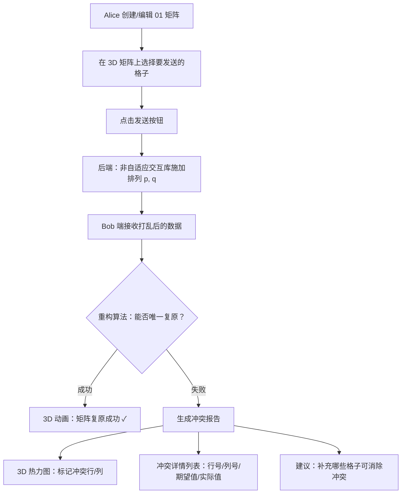

## 1. 产品概述

通信协议可视化沙盘——一个基于3D可视化的交互式数学通信协议演示工具。用户在3D矩阵中选择要发送的格子，系统模拟行列打乱后检测Bob是否能成功复原原始矩阵，并精确报告冲突位置。

- 目标用户：信息论/组合数学研究者、算法竞赛选手、通信协议教学场景
- 核心价值：将抽象的矩阵通信协议问题转化为直觉可感知的3D交互体验

## 2. 核心功能

### 2.1 用户角色

| 角色 | 说明 |
|------|------|
| 操作者（Alice） | 在3D矩阵上选择要发送的格子，制定通信策略 |
| 观察者（Bob） | 接收打乱后的数据，尝试重构原始矩阵 |

### 2.2 功能模块

1. **矩阵编辑页**：3D矩阵展示与格子选择、矩阵参数配置
2. **协议模拟页**：发送→打乱→重构全流程可视化
3. **冲突诊断页**：重构失败时的行列冲突热力图分析

### 2.3 页面详情

| 页面名称 | 模块名称 | 功能描述 |
|----------|----------|----------|
| 矩阵编辑页 | 3D矩阵画布 | Three.js渲染n×m的3D格子阵列，0为暗色/1为亮色，点击切换选择状态 |
| 矩阵编辑页 | 参数面板 | 配置矩阵尺寸(n,m)、随机填充概率、预设矩阵模板 |
| 矩阵编辑页 | 选择统计 | 实时显示已选格子数/总数、每行每列已选数量 |
| 协议模拟页 | 发送动画 | Alice选中的格子从3D矩阵飞出，形成数据包 |
| 协议模拟页 | 打乱动画 | 数据包按隐藏排列p,q重新排列，行列顺序被置换 |
| 协议模拟页 | 重构动画 | Bob根据接收数据尝试还原矩阵，逐步填充格子 |
| 协议模拟页 | 结果面板 | 显示重构成功/失败、匹配率、耗时 |
| 冲突诊断页 | 冲突矩阵热力图 | 高亮显示冲突行和列，红色=冲突，绿色=一致 |
| 冲突诊断页 | 冲突详情列表 | 列出每个冲突的具体行列位置及期望值vs实际值 |
| 冲突诊断页 | 建议面板 | 给出增加哪些格子可以消除冲突的提示 |

## 3. 核心流程

用户在3D矩阵上选择格子→点击"发送"→后端模拟非自适应交互库对数据施加行列排列(p,q)→Bob端接收打乱数据→后端运行重构算法→若重构失败，生成冲突报告（具体到行列）→前端3D展示冲突位置

## 4. 用户界面设计

### 4.1 设计风格

- **主色调**：深黑底色(#0a0a0f) + 霓虹绿(#00ff88) + 赛博青(#00d4ff) + 警告红(#ff3355)
- **按钮风格**：圆角微凸3D按钮，hover时发光边框
- **字体**：显示字体 JetBrains Mono（代码/数据感），正文 Inter（可读性）
- **布局风格**：左侧3D画布为主，右侧控制面板为辅
- **图标风格**：线性科技感图标（lucide-react）
- **整体氛围**：矩阵/信号处理终端风格，模拟数据流动的粒子效果

### 4.2 页面设计概览

| 页面名称 | 模块名称 | UI元素 |
|----------|----------|--------|
| 矩阵编辑页 | 3D矩阵画布 | 深色背景、发光格子、选中态脉冲动画、轨道控制器旋转缩放 |
| 矩阵编辑页 | 参数面板 | 暗色毛玻璃面板、滑块控件、数值输入框 |
| 矩阵编辑页 | 选择统计 | 柱状图实时统计每行/列选择数 |
| 协议模拟页 | 发送动画 | 格子飞出粒子轨迹、数据包光晕 |
| 协议模拟页 | 打乱动画 | 行列交换的3D翻转动画、排列箭头指示 |
| 协议模拟页 | 重构动画 | 格子逐步亮起的波纹扩散效果 |
| 冲突诊断页 | 冲突矩阵 | 红绿热力图3D渲染、冲突格子闪烁 |
| 冲突诊断页 | 冲突列表 | 可滚动表格、行号/列号高亮 |

### 4.3 响应式设计

- 桌面端优先（1920×1080为基准）
- 3D画布占主视口，控制面板侧栏可折叠
- 移动端：3D画布全屏叠加浮动控制面板

### 4.4 3D场景指导

- **环境**：深空黑背景，微弱星尘粒子漂浮
- **灯光**：环境光(低强度蓝调) + 方向光(冷白) + 选中格子自发光(霓虹绿点光源)
- **摄像机**：45度等轴测视角为默认，支持自由轨道旋转
- **构图焦点**：矩阵居中，选中格子突出悬浮
- **交互**：鼠标悬停格子高亮边框，点击切换选择态，右键拖拽旋转视角
- **后处理**：Bloom效果让发光格子产生辉光，轻微色差增强科技感
- **性能预算**：最大支持20×20矩阵(400格子)，保持60fps
