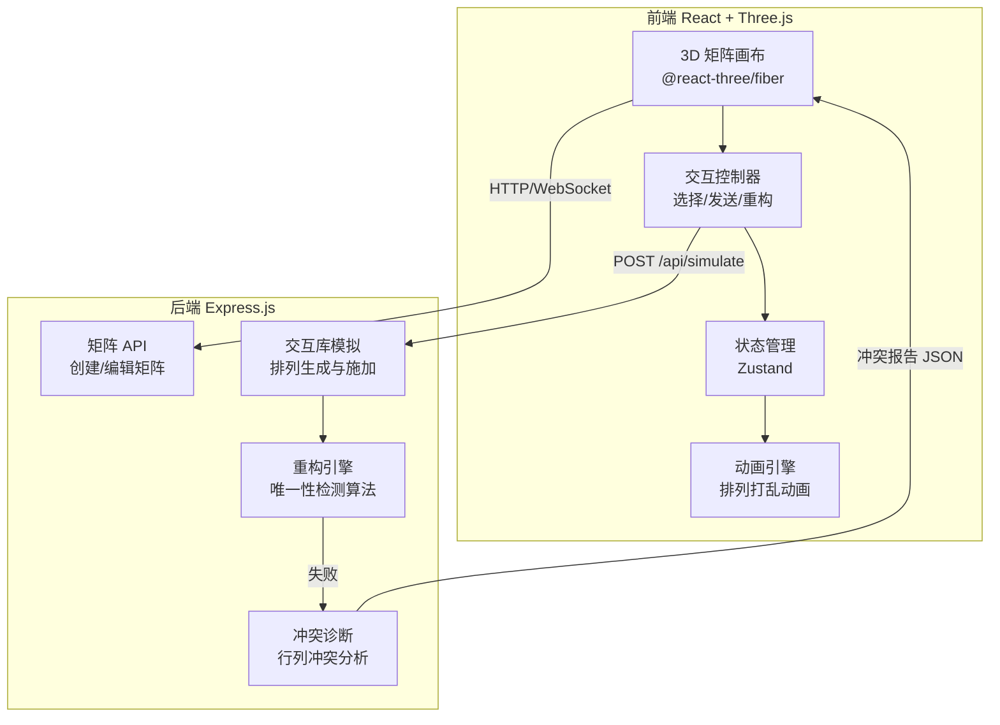

## 1. 架构设计



## 2. 技术说明

- **前端**：React@18 + @react-three/fiber@8 + @react-three/drei@9 + @react-three/postprocessing + tailwindcss@3 + vite + zustand
- **初始化工具**：vite-init (react-express-ts 模板)
- **后端**：Express@4 + TypeScript (ESM)
- **数据库**：无（纯计算模拟，状态存于前端）

## 3. 路由定义

| 路由 | 用途 |
|------|------|
| / | 主页面：矩阵编辑 + 协议模拟 + 冲突诊断（单页应用，Tab切换） |

## 4. API 定义

### 4.1 创建随机矩阵

```typescript
POST /api/matrix/create
Request:  { rows: number; cols: number; density: number }
Response: { matrix: number[][]; id: string }
```

### 4.2 模拟通信协议

```typescript
POST /api/simulate
Request:  {
  matrix: number[][];
  selectedCells: { row: number; col: number }[];
}
Response: {
  success: boolean;
  permutedMatrix: number[][];
  permutationP: number[];  // 行排列
  permutationQ: number[];  // 列排列
  reconstructedMatrix: number[][] | null;
  conflicts: ConflictInfo[] | null;
  matchRate: number;
}
```

### 4.3 冲突详情

```typescript
// ConflictInfo 类型定义
interface ConflictInfo {
  type: "row" | "col";
  index: number;           // 原始矩阵中的行/列索引
  expectedValues: number[];
  actualValues: number[];
  ambiguousPositions: { row: number; col: number }[];
  suggestion: string;      // 建议补充的格子
}
```

### 4.4 获取建议补充格子

```typescript
POST /api/suggest
Request:  {
  matrix: number[][];
  selectedCells: { row: number; col: number }[];
  conflicts: ConflictInfo[];
}
Response: {
  additionalCells: { row: number; col: number }[];
  reason: string;
}
```

## 5. 核心算法说明

### 5.1 非自适应交互库模拟

1. 生成随机行排列 p 和列排列 q（均为 0..n-1 的随机置换）
2. 对 Alice 发送的数据子集，施加排列变换：(i,j) → (p[i], q[j])
3. Bob 收到的是打乱后的 (值, p[i], q[j]) 三元组集合

### 5.2 重构算法

1. Bob 从接收数据中提取每行的值模式
2. 尝试通过行值模式的唯一性匹配回原始行
3. 若所有行模式唯一，则重构成功；否则产生行冲突
4. 同理检测列模式唯一性
5. 合并行冲突和列冲突，生成完整冲突报告

### 5.3 冲突诊断

- **行冲突**：两行在选中列上的值模式相同，无法区分 → 报告冲突行号和模糊位置
- **列冲突**：两列在选中行上的值模式相同，无法区分 → 报告冲突列号和模糊位置
- **建议**：找出能使冲突行/列模式区分开的最少额外格子
